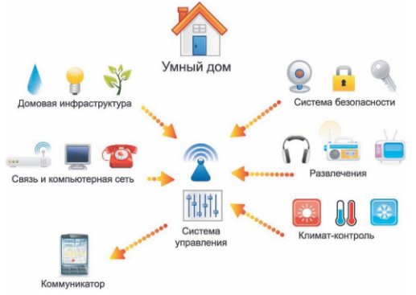
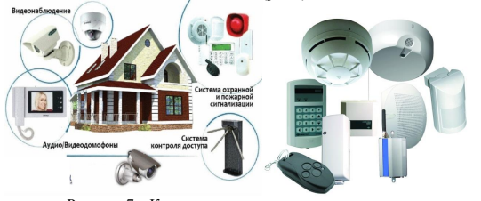
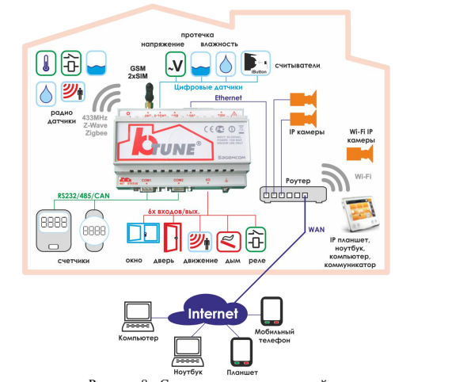

Тема 3.4 **ИНФОРМАЦИОННЫЕ СИСТЕМЫ УПРАВЛЕНИЯ  «УМНЫЙ ДОМ»** 

1. ***Умный дом – возможности, функции и состав*** 

***«Умный дом»*** - это автоматизированная интеллектуальная система, созданная с целью управления инженерными элементами и системами помещения. 

Под  термином  «умный  дом»  на  сегодняшний  день  подразумевается комплексное  внедрение  в  быт  высокотехнологичных  устройств,  позволяющих обеспечить  высокий  уровень  комфорта  жильцов.  Множество  устройств, объединенных  в  одну  систему,  обеспечивают  безопасность  жилья,  комфорт  и экономию  ресурсов.  Кроме  этого,  одним  из  критериев  «умного  дома»  является централизованное управление всеми задействованными в комплексе устройствами.  

Система  «умный  дом»  подразделяется  на  отдельные  подсистемы  и  может управлять и контролировать (рис.1): 
- системы освещения; 
- электросистемы; 
- системы вентиляции; 
- климат контроль; 
- мультирум; 
- системы видеонаблюдения; 
- пожарная сигнализация; 
- охранная сигнализация; 
- системы контроля доступа (распознает хозяев); 
- контроль нагрузок и аварийных состояний. 

Рисунок 1 – Система управления «Умный дом» 

Система  управления  умным  домом  представляет  собой  комплекс  аппаратно- программных средств, предназначенный для выполнения трех основных функций: 

1) *управление  различным  оборудованием  дома  из  одной  точки*.  Например, включать-выключать  свет  в  любой  из  комнат  или  менять  его  интенсивность, задвигать  или  раздвигать  шторы,  включать  и  выключать  кондиционер,  менять температуру,  управлять  любыми  функциями  бытовых  приборов,  обладающих подобной возможностью. 
2) *выполнение сценариев*. Сценарий – это совокупность заранее согласованных с  пользователем  запрограммированных  действий,  которые  система  умный  дом выполняет по команде. Например, когда пользователь приходит домой после работы и садится смотреть телевизор, он может послать умному дому команду «Просмотр фильма»,  тогда  комплекс  приглушит  свет,  задвинет  жалюзи  и  автоматически подстроит громкость звука. 
3) *автоматическое  управление  умным  домом*.  В  этом  случае  система  сама принимает решения о тех или иных действиях, например, поддерживая постоянной температуру в помещении, ориентируясь на показатели термометра. Аналогичным образом можно управлять, например, электрической сауной или поливом растений. 

С  помощью  системы  умный  дом  можно  управлять  всеми  потребителями, подключенными  к  проводке,  при  помощи  одного устройства  –  мобильного (планшет,  смартфон,  пульт  ДУ)  и/или  стационарного  (компьютер/ноутбук, графический интерфейс системы). При этом все датчики и реле также присутствуют в системе и производят управление электропитанием в автоматическом режиме. 

Кроме элементарных бытовых потребителей, интеллектуальный (умный) дом может  производить  контроль  и  управление  за  системами  связи,  пожаротушения, охранных сигнализаций, телефонных линий и многим другим, включая инженерные коммуникации. 

2. ***Оборудование системы умный дом*** 

Имеется  разнообразное  оборудование  для  системы  умный  дом.  В  общем, система состоит из таких элементов: 
- контроллер умного дома (главный и дискретные модуляторы ввода-вывода); 
- модули расширения и связи (коммутаторы, роутеры, GPS/GPRS модули); 
- элементы коммутации электрической цепи (реле, диммеры, блоки питания); 
- измерительные приборы, датчики и сенсоры (движения, температуры, света и др.); 
- элементы управления системой (пульты, сенсорные панели, КПК, планшеты); 
- исполнительные механизмы (клапаны воды, вентиляции, газа, ролеты и т. д.). Оборудование может использоваться как проводное и беспроводное. 

При  выборе  оборудования  также  важно  учесть,  какой  протокол  (способ) передачи  данных  системы  «Умный  дом»  используется.  В  настоящее  время существуют разные подходы к системе управления домом:  
*BPT*  -  система  домашней  автоматизации  с  распределённым  интеллектом, использующая  закрытый  протокол  передачи  данных.  Реализуется  управление освещением,  домашней  автоматикой,  кондиционированием,  отоплением, инженерной и охранной сигнализацией, гомофонией;  
*LanDrive* -  платформа  для  построения  шинных  распределённых  систем управления  внутренним  и  уличным  освещением,  силовыми  нагрузками, электроприборами, а также такими системами, как отопление, кондиционирование, вентиляция, охранная сигнализация, контроль доступа и протечек воды;  
*C-Bus* -  это  система  с  распределённым  интеллектом  (без  центрального процессора),  использующая  кабель  5-категории  (Cat.5),  длина  которого  в  одном сегменте  может  составлять  1000 м,  таких  сегментов  в  одну  систему  можно объединять до 255.  
*X10* -  протокол  управления  электроприборами.  Сигнал  передается  по электрическим проводам либо в радиодиапазоне. 

Основные производители оборудования системы «Умный дом»: 
- AMX, Crestron (США); 
- ABB, Gira (Германия); 
- Legrand, Schneider Electric (Франция). 

Системы управления «Умный дом» подразделяются на три класса: 
1) ***централизованные***  -  строятся  на  основе  применения  широкого  спектра управляющих центральных  контроллеров и  множества исполнительно-командных блоков - CRESTRON;  
2) ***децентрализованные***  - управление осуществляется в пределах устройств,  связанных  друг  с  другом  непосредственно,  без  иерархии  или  сетевого контролирующего  устройства,  все  устройства  (компоненты,  абоненты) обмениваются информацией по общему каналу – шине - EIB;  
3) ***смешанные***  (псевдодецентрализованные)  -  метод  и  протокол  передачи управляющих  сигналов-команд  по  силовой электропроводке  на  электронные модули,  к  которым  подключены  управляемые  электробытовые  и  осветительные приборы - Х-10. 

3. ***Составляющие элементы системы умный дом*** 

Система  «умный  дом»  имеет  модульную  конструкцию  и  состоит  из функционально разграниченных блоков с полной или частичной их интеграцией в единую  систему  (рис.2).  Каждый  модуль  задействован  в  выполнении  строго обозначенных задач, между тем, блоки могут взаимодействовать между собой. 

Рисунок 2 - Приборы, управляемые контроллером системы умный дом 

*Возможное модульное наполнение современной системы «умный дом»:* 

- ***Центральный  управляющий  контроллер***,  объединяющий  другие компоненты,  и  обеспечивающий  их  взаимодействие.  Таким  контроллером  может выступать  как  промышленное  решение  в  виде  законченного  устройства,  так  и обычный компьютер с соответствующим программным обеспечением (рис.3). 

 

Рисунок 3 - Контроллеры  

В  качестве  управляющего  контроллера  системы  «умный  дом»  наиболее оправдано  применение  одноплатного  компьютера  промышленного  исполнения. Подобные  компьютеры  отличаются  небольшим  размером,  малой  потребляемой мощностью,  отсутствием  механических  частей  (вентиляторы,  жесткие  диски)  и работают на программном обеспечении с открытым исходным кодом. Количество и тип имеющихся интерфейсов в большинстве случаев можно изменять и дополнять. 

Доступ  к  контроллеру  осуществляется  по  сети,  с  использованием  WEB интерфейса  или  клиентских  приложений.  Существуют  и  готовые  решения, предназначенные  для  управления  всем  комплексом,  и  предоставляющие пользователю для настройки простой дружественный интерфейс. 

Для управления «умным домом» удобно использовать универсальные пульты (рис.4),  поддерживающие  выполнение  макросов  —  упорядоченных  наборов действий.  Радиопульты  в  данном  случае  эффективнее  ИК-пультов,  так  как позволяют осуществлять управление вне прямой видимости ИК-приемника. Более современным пультом управления может выступать смартфон с установленным на нем специализированным программным обеспечением. 

 

Рисунок 4 – Универсальные пульты для умного дома 

- ***Климатическая  система***.  Состоит  из  блоков  управления  отоплением  и вентиляцией  (рис.5),  обеспечивает  поддержание  заданного  микроклимата  в помещении.  Управление  климатом  реализуется  при  помощи  оценки  показаний датчиков  температуры  и  влажности.  На  основании  анализа  этих  данных производится автоматическая регулировка отопления, включение или выключение систем кондиционирования, вентиляции и увлажнения. 

Рисунок 5 – Управление климатом умного дома 

- ***Управление  освещением  и  коммутацией*** энергопотребителей.  Реализуется посредством установки датчиков освещенности, присутствия или же совмещенных (рис.6).  При  необходимости  управляющий  контроллер  позволяет  управлять освещенностью  по  расписанию.  При  использовании  диммерных  устройств возможна  не  только  дискретная,  но  и  плавная  регулировка  яркости  источников света. 

Рисунок 6 – Управление освещением умного дома 

- ***КТСО (комплекс технических средств охраны).*** Включает в себя охранно-пожарную  сигнализацию,  систему  видеонаблюдения  и  модули  дистанционного уведомления владельца о тревожных ситуациях (рис.7). 

 

Рисунок 7 – Комплекс технических средств охраны 
В  качестве  детектирующих  устройств  используются  датчики  присутствия, реагирующие на появление в контролируемой зоне ИК-излучения, присущего телу человека.  Для  обнаружения  открытия  двери  устанавливаются  магнитоконтактные датчики. Пожарная безопасность контролируется датчиками дыма, температуры и утечки газа. Многие современные системы охранно-пожарной сигнализации имеют модуль радиосвязи, позволяющий уведомлять владельца при помощи сетей GSM или 3G. Часто ОПС допускает подключение любых электроприборов через сухое реле, что позволяет по сигналу тревоги блокировать замок, включать освещение, сирену  и  т.д.  Иногда  в  состав  ОПС  входит  датчик  влажности,  позволяющий своевременно выявить факт протечки воды. 

*Система  контроля  доступа.*  Состоит  из  устройства  идентификации, непосредственно  идентификаторов  (электронные  ключи,  радиометки,  отпечаток пальца),  устройства  блокировки  (замок,  шлагбаум,  автоматические  ворота)  и предназначена для разграничения доступа в помещение или на территорию. 

*Система  видеонаблюдения.*  Представляет  собой  комплекс,  состоящий  из видеокамер и устройства обработки и хранения видеосигнала. 

- ***Система  учета,  сбора  и  хранения  данных**.*  В  задачи  модуля  входит  сбор информации  с  приборов  учета,  фиксация  различных  событий  и  предоставление данных для анализа с целью оценки эффективности всего комплекса. В большинстве случаев данный функционал реализуется при помощи управляющего контроллера с использованием соответствующего программного обеспечения. 

- ***Каналы  связи***.  В  качестве  каналов  передачи  данных  используются  сети, работающие  с  протоколом  TCP/IP  в  проводном  или  беспроводном  исполнении (рис.8).  Для  интеграции  в  сеть  приборов,  имеющих  специализированные интерфейсы, используются соответствующие конвертеры. 

Рисунок 8 - Системы управления умный дом 

Транспортным каналом, как правило, является локальная сеть, выполненная по проводной  или  беспроводной  технологии.  Для  управление  сетью  используется маршрутизатор,  позволяющий  контролировать  все  сетевые  устройства  и обеспечивать  защиту  от  несанкционированного  доступа  к  каждому  из  них. Современные  технологии  высокоскоростной  передачи  данных  позволяют одновременное использование сети для обмена информацией между компьютерами, передачи сигналов IP-телевидения, телефонии, работы компонентов «умного дома». 

Помимо  вышеописанного,  в  системах  «умный  дом»  нередко  используются устройства, не взаимодействующие со всем комплексом. Это могут быть приборы для  автоматической  уборки (роботы-пылесосы), системы  автоматического полива растений, кормления  домашних животных и многое другое. Несмотря на то, что подобные  приборы  автономны,  их  интеграция  с  системой  вполне  возможна  при помощи  простого  включения  или  выключения  электропитания  управляющим контроллером. 

***Управление  системой  интеллектуального  (умного)  дома***  может производиться тремя способами:  
1) *Беспроводной  локальный  способ  управления* с  ограниченным  радиусом производится  с  применением  устройств  управления  через  локальный  (местный) радиосигнал, Wi-Fi или Bluetooth беспроводные радиосети. 
2) *Беспроводной  удаленный  способ  управления* доступен,  если  произведен монтаж системы умный дом к глобальным сетям или модулям расширения связи, обеспечивающим  к  ним  доступ.  К  таковым  сетям  можно  отнести  GSM/GPRS (управление  по  средствам  мобильной  связи),  мобильный  интернет,  специальный выделенный радиосигнал. 
3) *Проводной  локальный  способ  управления*,  в  зависимости  от  применяемых протоколов  передачи  данных  системы  умный  дом,  может  иметь  среды  передачи данных  по  витой  паре  (кабелю  компьютерной  сети),  электрической  проводке (протокол системы X10) или каким-либо другим кабелем. 

Устройства управления идут в комплекте с системой – это графические панели управления  с  сенсорным  или  кнопочным  вводом,  пульты  с  приемниками, настроенными на определенную частоту. Не идущие в комплекте устройства, как мобильные  компактные  компьютеры  (смартфоны,  планшеты)  настраиваются  при помощи  специального  программного  обеспечения  для  управления  удаленным способом, через всемирные информационные сети.** 
