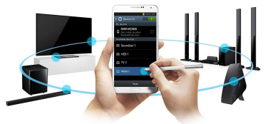

Тема 3.5 **ИНФОРМАЦИОННЫЕ СИСТЕМЫ ОБСЛУЖИВАНИЯ МНОГОЗОННОГО МУЛЬТИМЕДИЙНОГО ПРОСТРАНСТВА** 

1. ***Мультимедийные системы*** 

***Мультимедийные  системы***  —  это  целый  комплекс  аппаратных  и программных  решений,  обеспечивающих  возможность  создания,  хранения  и воспроизведения аудио и видеоинформации.  

Мультимедийные технологии используют аппаратные и программные средства. 

К ***аппаратным*** относятся аналоговые и цифровые преобразователи сигналов, видеопроцессоры,  декодеры,  звуковые  и  видеокарты.  То  есть  все  устройства звукозаписи, воспроизведения, передачи и обработки звука и изображения (в том числе и средства виртуальной реальности – очки, бинокли, VR-шлемы и перчатки, 3D-панели). 
***Программные средства*** – это то, что помогает разрабатывать мультимедийные приложения. То есть программы по работе с графикой и изображением, созданию анимации, в том числе 3D-анимации, обработке звука, видеомонтажу и т.д. 

Типов интеллектуальных медиасистем на сегодняшний день довольно много, основными из них являются: 
***Аудиосистемы***  имеют  широкое  применение  –  от  конференц-залов  и переговорных комнат до вокзалов и стадионов. Без них невозможно представить проведение  театрализованных  представлений,  концертов,  лекций.  Аудиосистемы необходимы  для  оперативного  оповещения  людей  в  случае  опасности  или  для донесения  важной  информации,  поэтому  их  также  устанавливают  в  офисах, торговых центрах, школах и других учреждениях.  
***Видеосистемы***  и  системы  видеотрансляции   -  дисплеи  и  проекторы, светодиодные  фасады  и  экраны,  видеостены  и  многие  другие  инструменты визуализации выполняют две основные функции: трансляция видеоинформации (в том числе в режиме реального времени) и видеонаблюдение. 

Условно  системы  мультимедиа  можно  разделить  на  системы  домашнего  и коммерческого или общего назначения. 

Системы  мультимедиа  домашнего  назначения  используются  в  основном  для развлечения  и  отдыха,  в  то  время  как  коммерческие  мультимедийные  системы необходимы  для  оптимизации  рабочего  процесса,  обучения  сотрудников, проведения видеопрезентаций. 

2. ***Домашние мультимедийные системы*** 

***Домашние  мультимедийные  системы***  –  это  организованная  работа различного оборудования, связанного в единый комплекс. При помощи устройств управления  (сенсорных  панелей,  пультов  управления)  осуществляется программирование  сценариев  работы  и  их  запуск.  Домашние  мультимедийные системы  включают  в  себя: домашний  кинотеатр,  мультирум,  телевидение, медиасервер и аудиосистемы. 
***Система  Мультирум  (Multiroom)***  относится  к  мультимедийным развлекательным  системам  концепции  Умный  дом. Система  выполняет  функцию распределения  аудио  и  видеосигнала  по  нескольким  зонам  помещения  и близлежащей  к  дому  территории  вне  зависимости  от  того,  где  располагается источник звука. Таких зон и источников может быть неограниченное количество. Вся  медиаинформация  (музыка,  фильмы,  фотографии  и  т.  п.)  доступна  в  любой точке дома с системой. 

В состав мультирума входит (рис.1): 
- источники сигнала; 
- акустика; 
- телевизоры; 
- коммутационное и усилительное оборудование; 
- кабели (аудио-, видео-); 
- средства  управления  (сенсорные  панели,  пульты  управления,  планшеты  и т.д.). 

Рисунок 1 – Система мультирум 

Основа мультирума — специальный контроллер для распределения сигналов по зонам. Аудио/видео сигналы поступают на контроллер, который распределяет их по другим зонам в зависимости от текущих настроек и команд. Сигналы передаются по кабельной сети, охватывающей всю квартиру или дом. 

Источники  сигнала  (медиасервер,  FM-тюнер,  спутниковый  ресивер,  CD  или DVD-проигрыватель) располагаются, как правило, в специально отведенном для них помещении (техническом или серверном). Там же собирается и все необходимое оборудование:  AV-коммутатор,  контроллер,  ресивер,  усилитель.  Колонки  и телевизионные панели располагаются в различных помещениях дома. В последнее время для функций управления все чаще используются смартфоны и планшеты. 

Возможности системы мультирум включают также: воспроизведение, хранение и запись всех известных стандартов аудио форматов; воспроизведение аудиофайлов во всех существующих стандартах звука; создание библиотек звукозаписей. 

***Медиасервер*** – это домашний мультимедийный центр развлечений, благодаря которому  можно  собрать  в  одном  месте  и  систематизировать  коллекцию аудио/видео  файлов и  фотографий. Это оборудование необходимо не  только для надежного  хранения  и  каталогизации  аудио  и  видеобиблиотеки,  но  и  для обеспечения высокоскоростного доступа к данным. 

Возможности  медиасервера  включают  также:  добавление  новых  файлов  и удаление  существующих;  копирование  данных  на  компьютер  пользователя; взаимосвязь с Сетью Интернет (создание, редактирование и получение информации о  медиа  контенте);  работа  с  PlayLists;  контроль  состояния  дискового  массива, сервисные функции; прослушивание радио через Интернет. 

3. ***Системы мультимедиа коммерческого или общего назначения*** 

***Системы  мультимедиа коммерческого  или  общего  назначения*** предназначены для  организации  комфортных  и  прогрессивных  условий  работы сотрудников, выполняют функции сопровождения бизнес-процессов.  

Коммерческие системы мультимедиа включают в себя:  
- систему  аудио  и  видео  конференц-связи  (конгресс-система,  система голосования, терминалы ВКС и проч.),  
- систему видеоотображения (плазменные панели, видеостены, мониторы LCD, электронные доски и проч.),  
- систему интегрированного управления (управление видео и аудио системами, электрическими системами, климатическим оборудованием, освещением и проч.). 

***Системы приема и отображения информации***  - это комплекс  технических средств,  обеспечивающих  предоставление  информации в  форме,  удобной  для зрительного  восприятия  человеком. Применяются  в  самых  различных  областях от торговых  центров до  систем  видео  фиксации движения  транспортных средств. Все  более  широкое  применение  системы  отображения  находят  в коллективном  использовании  -  конференц-залы,  ситуационные  центры, диспетчерские, учебные классы и т.д. 

К системам отображения можно отнести следующее оборудование: 
- Проекционные модули и видеокубы 
- Видеостены 
- Плазменные и LCD-панели, мониторы 
- Экраны прямой или обратной проекции 
- Системы зеркал обратной проекции 
- Презентационное оборудование 

***Презентационные  системы***  —  это  комплекс  высокотехнологичного мультимедийного  оборудования  предназначенный  для  проведения  разного  рода деловых мероприятий — конференций, совещаний, семинаров (рис.2). 

Рисунок 2 – Проекционное оборудование 

***Конференц-связь***  –  это  комплекс  специализированного  оборудования, предназначенный  для  организации  совещаний,  семинаров,  конгрессов  и  других крупных дискуссий.  

Современная система позволяет организовать эффективную коммуникацию с неограниченным  количеством  участников,  синхронный  перевод  при  проведении международных  мероприятий;  проведение  голосований  и  подсчет  голосов, открывает  широкие  возможности  по  управлению  регламентом  и  ходом мероприятия.  

В стандартный комплект конференц-системы, как правило, входят (рис.3): 
- микрофонные пульты делегатов и председателя мероприятия; 
- центральный блок, который отвечает за техническую координацию; 
- коммутационное оборудование, объединяющее все элементы системы. 

Рисунок 3 – Конференц-системы  

В  зависимости  от  модели  и  комплектации,  конференц-системы  могут обеспечивать: 
- проведение мероприятий в различных режимах с усилением речи; 
- работу  в  автоматическом  или  в  ручном  (с  управлением  оператором включением/выключением микрофонных пультов) режимах; 
- голосование; 
- синхронный перевод; 
- вывод  на  общий  монитор  в  зале,  мониторы  председателя  и  участников различной информации: регламента конференции, данных о выступающем, итогов голосования и др.; 
- согласование с системой технологического телевидения (наведение камер на выступающего при включении им микрофонного пульта). 

***Видеоконференцсвязь***  позволяет  организовать  живой  диалог  в  режиме реального  времени,  независимо  от  того  насколько  удалены  участники коммуникации друг от друга, обеспечивая не только вербальный, но и визуальный контакт (рис.4).  

Рисунок 4 – Система видеоконференцсвязи 

***Видеоотображение*** – это целая группа различных современных технологий, общим  назначением  которых  является  трансляция  контента  массовой  аудитории. Подобные  комплексы  находят  широкое  применение  как  в  развлекательной индустрии,  например,  для  показа  анимационной  рекламы  в  торговых  центрах  и кинотеатрах,  так  и  в  деловой  среде  –  при  проведении  презентаций,  пресс- конференций и т.д. 

***Видеостены*** - составленные из нескольких экранов-модулей и подключенные к специализированному  программному  комплексу   позволяют  транслировать видеоизображение колоссально огромных масштабов в режиме реального времени (рис.5). 

 

Рисунок 5 – Видеостены 

***Телеприсутствие***  –  технология,  которая  во  время  проведения  сеансов видеоконференцсвязи обеспечивает практически 100%-ный эффект присутствия в одном помещении территориально удаленных участников коммуникации (рис.6). 

Рисунок 6 – Панорамная система телеприсутствия 

***Системная  интеграция***  -  это  пакет  услуг  по  объединению  в  целостный комплекс  всех  имеющихся  на  предприятии  программных  и  аппаратных  средств (коммутационного оборудования, конференцсистем, аудио- и видеооборудования и т.д.). 

В  широком  смысле,  системная  интеграция  представляет  собой  процесс создания некого единого информационного пространства, функционально полного решения на базе действующих презентационных технологий. 

***Системы  видео-вывесок  и  видео-объявлений*** -  это  системы,  которые используются в сфере рекламы и информирования (рис.7).  

 

Рисунок 7 – Видео-вывески, видео-объявления 

Данные  системы  представляют  собой  дисплей  или  группу  дисплеев с визуальным  либо  звуко-визуальным  динамически  изменяющимся  контентом  и используются как в корпоративном так и общественном секторе. Контентом может быть текст,  фотографии,  аудио,  видео  или  веб-содержимое в  любой  комбинации. Шаблон отображения контента может быть практически любой, иметь полностью настраиваемый интерфейс и конфигурацию отображения материала для различных целей и сфер применения.  

Выбор того или иного оборудования зависит от ряда факторов: 
- объемов и скорости обновления информации; 
- порядок и алгоритм отображения информации; 
- характер и тип изображения; 
- размещения блоков информации на системах отображения; 
- последовательности  и  приоритета  отображения  информационных  блоков  и окон. 
