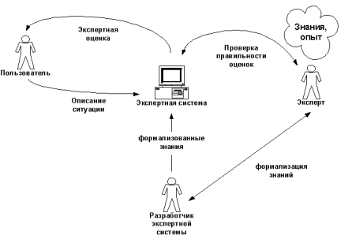
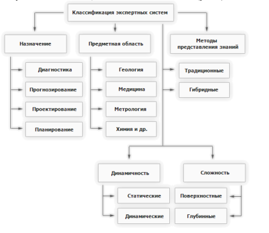
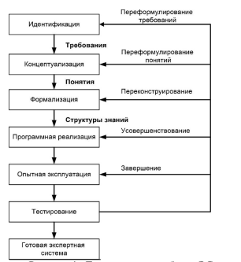

Тема 3.8 **ЭКСПЕРТНЫЕ СИСТЕМЫ** 

1. ***Характеристика экспертной системы*** 

Возникновение понятия интеллектуальных  систем  тесно  связано  с  понятием искусственного интеллекта (ИИ) и современной теории управления.** 

***Искусственный  интеллект  (ИИ)***  -**  наука  и  технология  создания** интеллектуальных  машин,  особенно  интеллектуальных  компьютерных  программ; свойство  интеллектуальных  систем  выполнять  творческие  функции,  которые традиционно считаются прерогативой человека.*** 
***Интеллектуальная система***  –*** автоматизированная система,*** основанная на*** знаниях,  или  комплекс  программных,  лингвистических  и  логико-математических средств для реализации основной задачи – осуществления поддержки деятельности человека и поиска информации в режиме продвинутого диалога на естественном языке.  Таким  образом,  любая  информационная  система,  решающая интеллектуальную  задачу  или  использующая  методы  искусственного  интеллекта, относится к интеллектуальным. 
Систему  искусственного  интеллекта,  построенную  на  основе  глубоких специальных знаний о некоторой предметной области (полученных от экспертов- специалистов этой области), называют *экспертной системой.****  
***Экспертные  системы  (ЭС)***  −**  это  компьютерная  программа,  которая моделирует рассуждения человека-эксперта в определенной области и использует для этого базу знаний, содержащую факты и правила об этой области, и процедуру логического вывода. 

Обобщенная  структура  экспертной  системы  представлена  на  рисунке  1. Следует учесть, что реальные ЭС могут иметь более сложную структуру, однако блоки, изображенные на рисунке, непременно присутствуют в любой экспертной системе. 

Рисунок 1 - Структура экспертной системы 

В  целом  процесс  функционирования  ЭС  можно  представить  следующим образом:  пользователь,  желающий  получить  необходимую  информацию,  через пользовательский  интерфейс  посылает  запрос  к  ЭС;  решатель,  пользуясь  базой знаний, генерирует и выдает пользователю подходящую рекомендацию, объясняя ход своих рассуждений при помощи подсистемы объяснений (рис.2). 

Рисунок 2 - Процесс функционирования экспертной системы 

***Пользователь** –*** специалист предметной области,*** для которого предназначена система.*** Обычно его квалификация недостаточно высока, и поэтому он нуждается в помощи и поддержке своей деятельности со стороны ЭС. 
***Инженер  по  знаниям**  –***  специалист  в  области  искусственного  интеллекта,*** выступающий  в  роли  промежуточного  буфера  между  экспертом  и  базой  знаний. Синонимы: ***когнитолог, инженер-интерпретатор, аналитик**.* 
***Интерфейс  пользователя**  –***  комплекс  программ,***  реализующих  диалог пользователя  с***  ЭС  как  на  стадии  ввода  информации,  так  и  при  получении результатов. 
***База  знаний*  (БЗ)**  *–***  ядро  ЭС,***  совокупность  знаний  предметной  области,*** записанная  на***  машинный носитель  в  форме,  понятной  эксперту  и  пользователю (обычно на некотором языке, приближенном к естественному). Параллельно такому "человеческому"  представлению  существует  БЗ  во  внутреннем  "машинном" представлении. 
***Решатель**  –***  программа,***  моделирующая  ход  рассуждений  эксперта  на основании*** знаний, имеющихся в БЗ. Синонимы: ***дедуктивная машина,*** ***механизм вывода,*** ***блок*** ***логического вывода**.* 
***Подсистема объяснений –*** программа,*** позволяющая пользователю получить ответы на*** вопросы: «Как была получена та или иная рекомендация?» и «Почему система приняла такое решение?» Ответ на вопрос «как» − это трассировка всего процесса получения решения с указанием использованных фрагментов БЗ, т.е. всех шагов цепи умозаключений. Ответ на вопрос «почему» − ссылка на умозаключение, непосредственно предшествовавшее полученному решению, т.е. отход на один шаг назад. Развитые подсистемы объяснений поддерживают и другие типы вопросов. 
***Интеллектуальный редактор БЗ** –*** программа,*** представляющая инженеру по знаниям*** возможность создавать БЗ в диалоговом режиме. Включает в себя систему вложенных меню, шаблонов языка представления знаний, подсказок (help-режим) и других сервисных средств, облегчающих работу с базой. 

В ЭС собственно знания отделены от алгоритмов, использующих эти знания. База знаний зависит от области применения, а механизм вывода независим от нее. *Источниками  знаний  для  ЭС*  служат***  статистические  данные,  литературные материалы, справочники, материалы экспериментов и исследований в проблемной области.  Классическим  источником  знаний  является  эксперт  –  профессионал  в данной предметной области. 

ЭС  –  это  сложные  программы,  которые  манипулируют  знаниями  в  целях получения эффективного решения в узкой предметной области. Как и настоящий человек  –  эксперт,  эти  системы  используют  символическую  логику  и  эвристики (эмпирические правила) чтобы найти решения. 

2. ***Классификация экспертных систем*** 

Общепринятая  классификация  экспертных  систем  отсутствует,  однако наиболее часто экспертные системы различают по назначению, предметной области, методам представления знаний, динамичности и сложности (рис. 3). 

Рисунок 3 -  Классификация экспертных систем 

По  **назначению**  классификацию  экспертных  систем  можно  провести следующим образом: 
- диагностика  состояния  систем,  в  том  числе  мониторинг  (непрерывное отслеживание текущего состояния); 
- прогнозирование  развития  систем  на  основе  моделирования  прошлого  и настоящего; 
- планирование  и  разработка  мероприятий  в  организационном  и технологическом управлении; 
- проектирование или выработка четких предписаний по построению объектов, удовлетворяющих поставленным требованиям; 
- автоматическое управление (регулирование); 
- обучение пользователей и др. 

По  **предметной  области**  наибольшее  количество  экспертных  систем используется  в  военном  деле,  геологии,  инженерном  деле,  информатике, космической  технике,  математике,  медицине,  метеорологии,  промышленности, сельском  хозяйстве,  управлении  процессами,  физике,  филологии,  химии, электронике, юриспруденции. 

Классификация экспертных систем по **методам представления знаний** делит их на: 
- *Традиционные экспертные системы* используют, в основном, эмпирические модели представления знаний и исчисление предикатов первого порядка.  
- *Гибридные  экспертные  системы*  используют  все  доступные  методы,  в  том числе оптимизационные алгоритмы и концепции баз данных. 

По **степени сложности** экспертные системы делят на: 
- *поверхностные  экспертные  системы*  представляют  знания  в  виде  правил «ЕСЛИ-ТО».  Условием  выводимости  решения  является  безразрывность  цепочки правил.  
- *глубинные экспертные системы* обладают способностью при обрыве цепочки правил определять (на основе метазнаний) какие действия следует предпринять для продолжения  решения  задачи.  Кроме  того,  к  сложным  относятся  предметные области, в которых текст записи одного правила на естественном языке занимает более 1/3 страницы. 

Классификация  экспертных  систем  по  **динамичности**  делит  экспертные системы на: 
- *статические*  -  предметная  область  называется  статической,  если описывающие ее исходные данные не изменяются во времени. Статичность области означает неизменность описывающих ее исходных данных. При этом производные данные  (выводимые из  исходных)  могут  и  появляться  заново,  и  изменяться  (не изменяя, однако, исходных данных). 
- *динамические* -  если исходные данные, описывающие предметную область, изменяются  за  время  решения  задачи,  то  предметную  область  называют динамической. В архитектуру динамической экспертной системы, по сравнению со статической, вводятся два компонента: подсистема моделирования внешнего мира; подсистема  связи  с  внешним  окружением.  Последняя  подсистема  осуществляет связи с внешним миром через систему датчиков и контроллеров.  

Кроме того, традиционные компоненты статической экспертной системы (база знаний  и  механизм  логического  вывода)  претерпевают  существенные  изменения, чтобы отразить временную логику происходящих в реальном мире событий.** 

3. ***Этапы разработки экспертных систем*** 

В  ходе  работ  по  созданию  ЭС  сложилась  определенная  технология  их разработки,  включающая  шесть  следующих  этапов  (рис.4):  идентификацию, концептуализацию,  формализацию,  выполнение,  тестирование,  опытную эксплуатацию.  

Рисунок 4 - Технология разработки ЭС 

На  этапе *идентификации* определяются  задачи, которые подлежат решению, выявляются цели разработки, определяются эксперты и типы пользователей. 
На  этапе  *концептуализации*  проводится  содержательный  анализ  проблемной области,  выявляются  используемые  понятия  и  их  взаимосвязи,  определяются методы решения задач. 
На  этапе  *формализации*  выбираются  ИС  и  определяются  способы представления всех видов знаний, формализуются основные понятия, определяются способы  интерпретации  знаний,  моделируется  работа  системы,  оценивается адекватность целям системы зафиксированных понятий, методов решений, средств представления и манипулирования знаниями. 
На  этапе  *выполнения*  осуществляется  наполнение  экспертом  базы  знаний.  В связи  с  тем,  что  основой  ЭС  являются  знания,  данный  этап  является  наиболее важным  и  наиболее  трудоемким  этапом  разработки  ЭС.  Процесс  приобретения знаний  разделяют  на  извлечение  знаний  из  эксперта,  организацию  знаний, обеспечивающую эффективную работу системы, и представление знаний  в виде, понятном ЭС. Процесс приобретения знаний осуществляется инженером по знаниям на основе анализа деятельности эксперта по решению реальных задач. 
